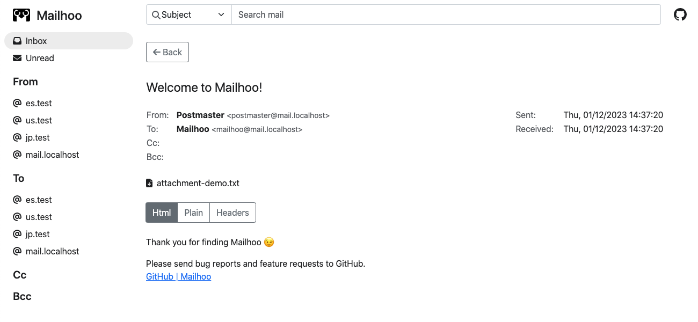

 Mailhoo
=======

Mailhoo is a SMTP server for development inspired by [MailHog](https://github.com/mailhog/MailHog).

[](https://github.com/yo1000/mailhoo/actions)<br>
[](https://sonarcloud.io/summary/new_code?id=yo1000_mailhoo)
[](https://sonarcloud.io/summary/new_code?id=yo1000_mailhoo)
[](https://sonarcloud.io/summary/new_code?id=yo1000_mailhoo)
[](https://sonarcloud.io/summary/new_code?id=yo1000_mailhoo)

Quickstart
----------

```shell
docker network create mailhoo

docker run \
  --net mailhoo \
  --name mailhoo_container \
  -p 8080:8080 \
  -p 1025:1025 \
  ghcr.io/yo1000/mailhoo
```

```shell
open http://localhost:8080
```

```shell
docker run \
  -i \
  --rm \
  --net mailhoo \
  dockette/mailx \
  sh -c '
    echo "Mailx test content" | mailx \
    -s "Mailx test subject" \
    -S smtp="mailhoo:1025" \
    -S from="Mailx Sender<sender@mailx.localhost>" \
    "Mailx Receiver<receiver@mailx.localhost>"
  '
```




How to run
----------

### Run with Docker image and use an external database as a data store

```shell
docker network create mailhoo

docker run \
  --net mailhoo \
  --name mailhoo_database \
  --env POSTGRES_DB=mailhoo \
  --env POSTGRES_PASSWORD=postgres \
  postgres
```

```shell
docker run \
  --net mailhoo \
  -p 8080:8080 \
  -p 1025:1025 \
  --env SPRING_DATASOURCE_URL=jdbc:postgresql://mailhoo_database:5432/mailhoo \
  --env SPRING_DATASOURCE_USERNAME=postgres \
  --env SPRING_DATASOURCE_PASSWORD=postgres \
  ghcr.io/yo1000/mailhoo
```

The following other databases are available.

| Database     | JDBC Connection URL example                    |
|:-------------|:-----------------------------------------------|
| H2 (default) | jdbc:h2:mem:mailhoo                            |
| PoasgreSQL   | jdbc:postgresql://{containerName}:5432/mailhoo |
| MySQL        | jdbc:mysql://{containerName}:3306/mailhoo      |
| MariaDB      | jdbc:mariadb://{containerName}:3306/mailhoo    |

### Run with native image

```shell
VERSION=2.0.0
curl -L -o mailhoo "https://github.com/yo1000/mailhoo/releases/download/${VERSION}/mailhoo-linux" && \
chmod +x mailhoo
./mailhoo
```

### Run with Java ARchive (jar)

See "Build Requirements" below for build requirements.

```shell
VERSION=2.0.0
curl -L -o mailhoo.jar "https://github.com/yo1000/mailhoo/releases/download/${VERSION}/mailhoo-${VERSION}.jar" && \
java -jar mailhoo.jar
```

### Run with Maven for development

See "Build Requirements" below for build requirements.

```shell
./mvnw clean spring-boot:run -Dspring-boot.run.jvmArguments="
  -Dspring.jpa.show-sql=true
  -Dspring.h2.console.enabled=true
  -Dserver.error.whitelabel.enabled=true
  -Dmailhoo.web.allowed-origins=http://localhost:8081
"
```

```shell
cd src/main/resources/node
NODE_ENV=development \
PORT=8081 \
API_BASE_URL=http://localhost:8080 \
npx webpack serve
```

```shell
open http://localhost:8081
```

### Main environment variables

| Name                               | Note                                             |
|:-----------------------------------|:-------------------------------------------------|
| `SPRING_DATASOURCE_URL`            | JDBC Connection URL to database.                 |
| `SPRING_DATASOURCE_USERNAME`       | Database Connection username.                    |
| `SPRING_DATASOURCE_PASSWORD`       | Database Connection password.                    |
| `SERVER_PORT`                      | API Server port. (default: `8080`)               |
| `MAILHOO_SMTP_PORT`                | SMTP Server port. (default: `1025`)              |
| `MAILHOO_WEB_ALLOWEDORIGINS`       | API Server allowed origin list.                  |
| `MAILHOO_DATA_JPA_TABLENAMEPREFIX` | Prefix for naming of table that stores messages. |


Build Requirements
------------------

When make a jar package.

- Java 17

When make a GraalVM based native image.

- GraalVM CE 22.3+

```shell
java -version
openjdk version "19.0.1" 2022-10-18
OpenJDK Runtime Environment GraalVM CE 22.3.0 (build 19.0.1+10-jvmci-22.3-b08)
OpenJDK 64-Bit Server VM GraalVM CE 22.3.0 (build 19.0.1+10-jvmci-22.3-b08, mixed mode, sharing)
```


How to build
------------

for Java ARchive (jar).

```shell
./mvnw clean package
```

for GraalVM based native binary.

```shell
./mvnw clean package -Pnative -DskipNativeTests
```
